# 🚀 InsightIQ — AI-Powered Data Analytics & Data Science Workspace


**InsightIQ** is a full-stack AI-powered data analytics and data science workspace that transforms raw tabular datasets into **data-quality reports, KPI recommendations, interactive visualizations, dashboards, machine-learning experiments, real-time predictions, and conversational data analysis** from one integrated platform.

It is designed as a complete workflow rather than a collection of disconnected tools:

**Upload Data → Profile Quality → Explore KPIs → Build Visualizations → Create Dashboard → Train ML Models → Test Predictions → Ask Questions in Data Chat → Save & Resume Activity**

> 🌐 **Live Application:** [InsightIQ | AI-Powered Data Analytics & Data Science Workspace](https://insightiq-analytics.vercel.app/)


---


---

## ✨ What InsightIQ Does

InsightIQ is designed around a simple workflow:

**Upload data → profile quality → explore KPIs and charts → build a dashboard → train an ML model → test predictions → ask questions in Data Chat → save the activity.**

### Core capabilities

| Area | What InsightIQ provides |
|---|---|
| Data ingestion | CSV, Excel, and JSON ingestion with schema inference and smart numeric coercion |
| Data quality | Missing values, duplicates, constant columns, likely identifiers, row/column counts, and health score |
| Analytics | Recommended KPIs, DAX-style formulas, aggregation logic, and chart recommendations |
| Dashboard | Add/remove KPI cards and visualizations into a composed executive dashboard |
| AutoML | Target analysis, feature selection, model recommendation, training, evaluation, feature importance, and prediction |
| Data Chat | Natural-language questions grounded through backend tools rather than invented statistics |
| Persistence & History | Logged-in users get a **My Datasets** page where they can reopen previously saved datasets and continue related KPI, ML, dashboard, and activity history |
| AI providers | Flexible LLM access through **Local Ollama** or **Groq Cloud**, including personal API-key fallback when shared/default API access is unavailable or reaches its usage limit |

---

## 🌟 Unique Project Features

InsightIQ combines several features that are usually found in separate analytics, BI, AutoML, and AI tools:

- **Login-based project continuity** — authenticated users get a personal **My Datasets** page instead of losing work after every session.
- **Dataset history / activity reopening** — saved datasets can be reopened with associated analysis activity.
- **Dual LLM strategy** — users can choose between **Local Ollama** and **Groq Cloud**.
- **Personal API-key fallback** — if default/shared Groq access is unavailable or its provider limit is exhausted, a user can supply his own API key from Settings.
- **LLM availability awareness** — the UI reports whether Ollama is reachable and whether the cloud provider is connected.
- **Deterministic Data Chat tools** — numerical answers are computed by backend data tools instead of being guessed by the LLM.
- **Analytics-to-dashboard workflow** — recommended KPI cards and charts can be moved directly into a composed dashboard.
- **AutoML-to-prediction workflow** — the same workspace covers target selection, feature engineering, model selection, evaluation, and interactive predictions.
- **Workspace session controls** — users can inspect the current dataset session and intentionally reset the active workspace when needed.

These features make InsightIQ not only a dashboard application, but a **stateful AI-assisted data-analysis workspace**.

---

## 📸 Screenshot Folder

All screenshots used by this README are included inside the repository documentation folder:

```text
docs/
└── screenshots/
    ├── 01-login.png
    ├── 02-upload.png
    ├── 03-overview-quality.png
    ├── 04-kpi-studio.png
    ├── 05-visualization-studio.png
    ├── 06-dashboard.png
    ├── 07-target-selection.png
    ├── 08-feature-engineering.png
    ├── 09-model-selection.png
    ├── 10-training-evaluation.png
    ├── 11-prediction-playground.png
    ├── 12-data-chat.png
    ├── 13-my-datasets.png
    ├── 14-settings.png
    └── SCREENSHOT_MAP.md
```

The image paths in this README already match these filenames, so after placing the `docs/screenshots/` folder in the repository root, GitHub will render every project screenshot automatically.

---

## 🖼️ Product Walkthrough

### 1. Authentication, Guest Mode & Persistent User Workspace

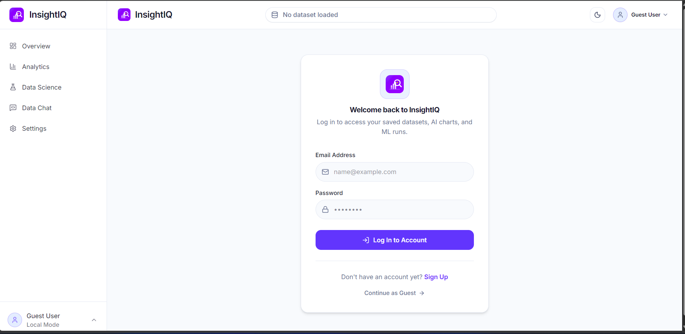

InsightIQ supports two ways of using the platform:

- **Guest Mode** for quickly exploring the application without creating an account.
- **Authenticated Mode** for users who want their work to persist across sessions.

When a user logs in, InsightIQ unlocks the **My Datasets** workspace. This page acts as a personal project-history area where the user can see previously saved datasets and reopen the related activity instead of starting from zero each time.

Saved activity can include the dataset itself and the work created around it, such as KPI selections, dashboard state, machine-learning runs, and conversation/session history depending on the stored activity.

### 2. Dataset Upload

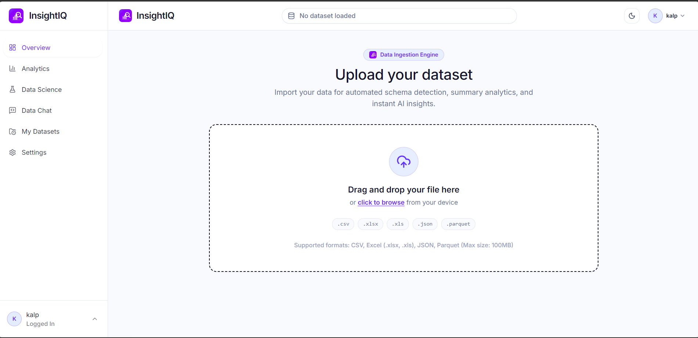

Users can drag and drop a dataset, after which the backend performs ingestion, schema detection, and profiling.

### 3. Dataset Health & Automated Profiling

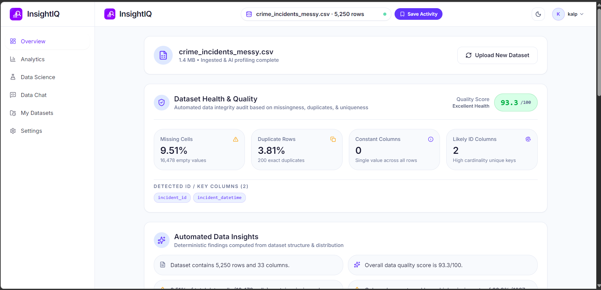

The Overview page summarizes data health, missing cells, duplicate rows, constant columns, likely IDs, and deterministic automated insights.

### 4. KPI Studio

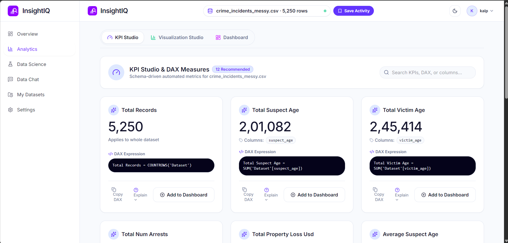

The analytics engine recommends measures and generates DAX-style expressions that can be added to the dashboard.

### 5. Visualization Studio

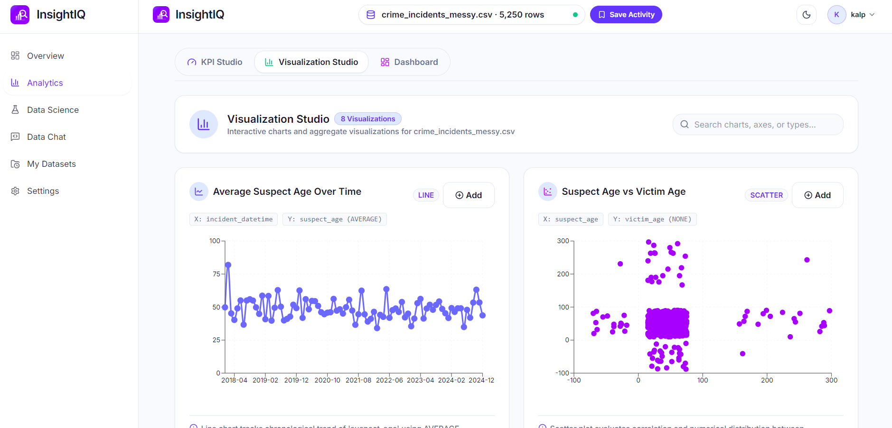

Charts are suggested from schema and data type relationships, including time-series and numerical correlation views.

### 6. Executive Dashboard

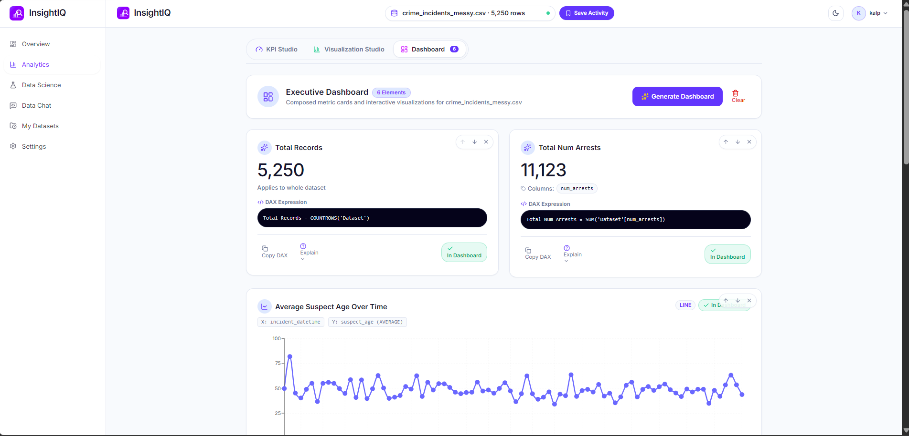

Selected KPI cards and visualizations are composed into a reusable dashboard workspace.

### 7. AutoML Target Selection

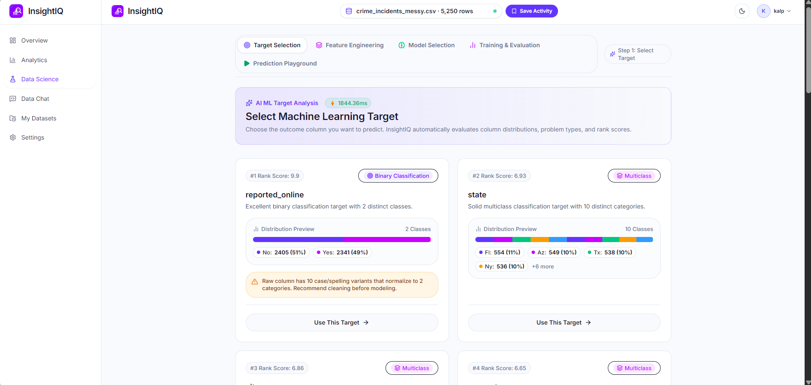

Candidate target columns are ranked and categorized into binary classification, multiclass classification, or regression problems.

### 8. Feature Engineering

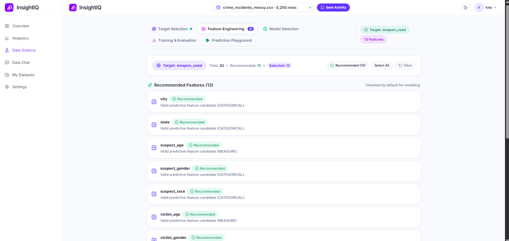

The system recommends model inputs and lets the user control the final feature set.

### 9. Model Recommendation

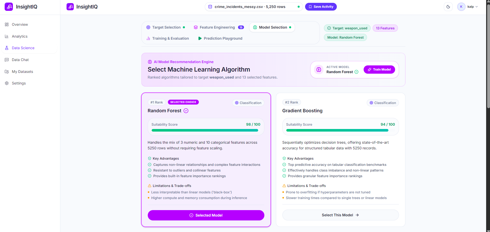

Candidate algorithms are ranked with suitability scores and trade-off explanations.

### 10. Training & Evaluation

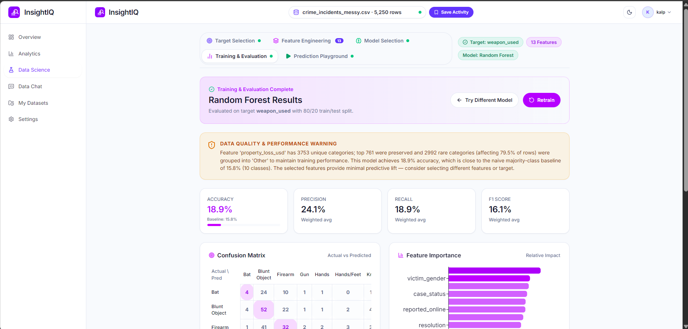

The evaluation workspace displays metrics, a confusion matrix, feature importance, and data-quality/model-performance warnings.

### 11. Prediction Playground

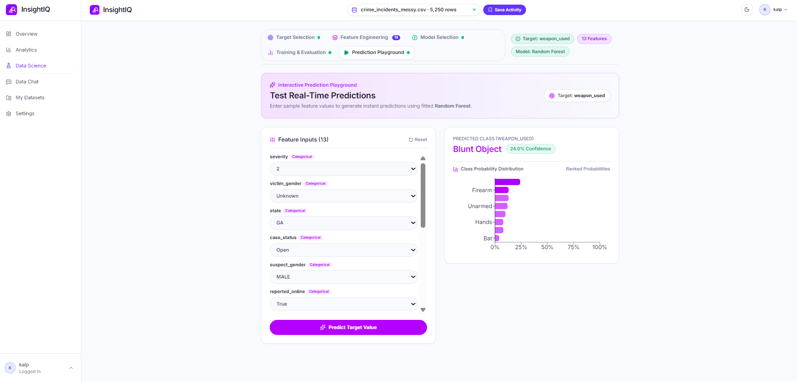

A trained model can be tested interactively with custom feature values and class-probability output.

### 12. Data Chat

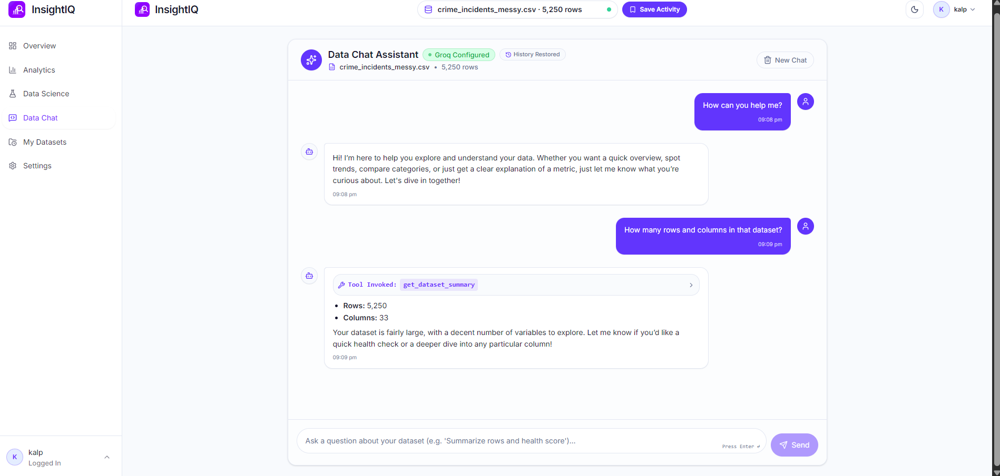

Data Chat answers questions using deterministic backend tools such as dataset summary, statistics, aggregation, category ranking, and chart recommendation.

### 13. My Datasets — User History & Saved Activities

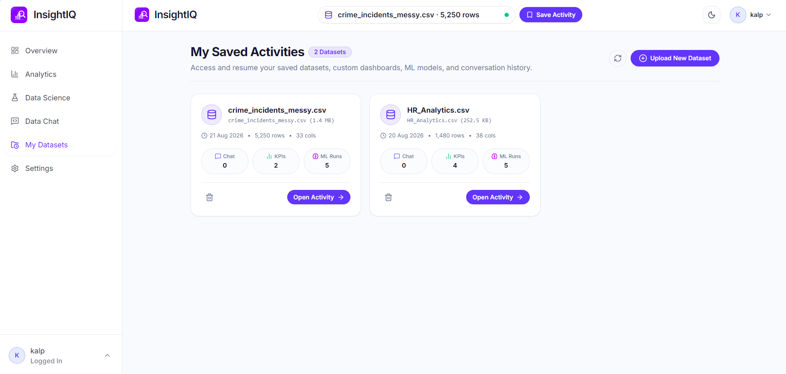

One of InsightIQ's important user-focused features is the **My Datasets** page, available for authenticated users.

Instead of treating every upload as a temporary session, the application keeps a history-oriented workspace where a logged-in user can:

- view previously saved datasets
- see dataset metadata such as row count and column count
- see related KPI and ML-run activity
- reopen an earlier dataset through **Open Activity**
- continue working without rebuilding the complete analysis flow from the beginning
- manage saved entries from one personal workspace

This turns InsightIQ from a one-time analytics tool into a reusable user workspace with project continuity.

### 14. Workspace Settings, Personal API Key & Local Ollama Fallback

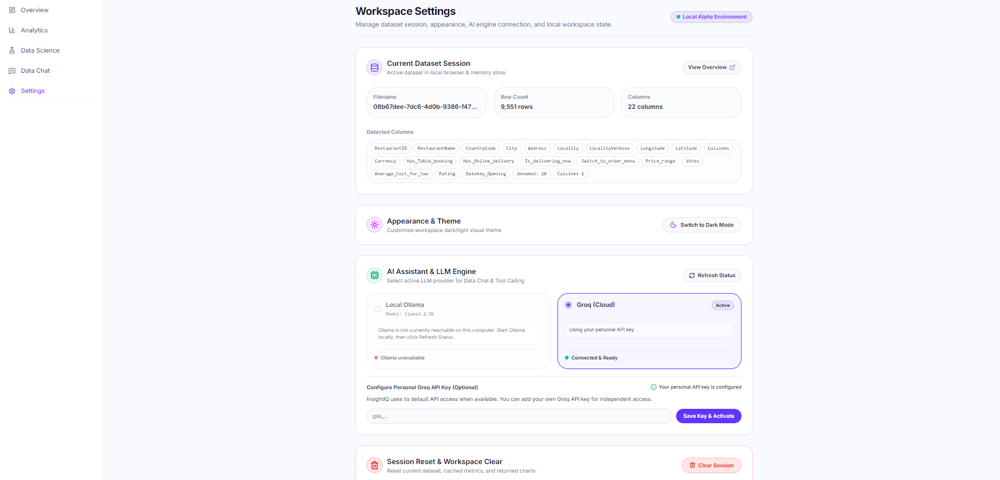

The **Settings** page is more than a visual-preference screen. It acts as the control center for the active dataset session and the AI provider used by Data Chat.

The workspace currently exposes:

- **Current Dataset Session** — displays the active filename, row count, column count, and detected columns.
- **Appearance & Theme** — allows switching the workspace theme.
- **AI Assistant & LLM Engine** — lets the user choose how the Data Chat LLM is powered.
- **Session Reset & Workspace Clear** — allows the active dataset/session state to be reset when the user wants a fresh workspace.

#### Flexible LLM provider logic

InsightIQ supports two practical AI-access paths:

**1. Local Ollama**

If Ollama is installed on the user's computer and the required model is available, InsightIQ can connect to the local model and use it for Data Chat and tool-calling. This gives the user a local inference option without depending on a cloud API.

Example model used by the project:

```bash
ollama pull llama3.2:3b
ollama serve
```

The Settings page checks whether Ollama is reachable. If it is unavailable, the UI clearly reports that state instead of silently failing.

**2. Groq Cloud**

InsightIQ can also use Groq as a cloud LLM provider. The project can use configured/default Groq access when available.

A particularly useful feature is the **Personal Groq API Key** option. If the default/shared API allowance is unavailable, reaches its usage limit, or the user wants independent access, the user can enter his own Groq API key directly from Settings and activate it for his session.

This gives the user three useful states:

```text
Default/Configured Groq Access
            ↓
If unavailable / usage limit reached
            ↓
User adds Personal Groq API Key
            ↓
Groq becomes available again for that user

OR

Local Ollama installed + model available
            ↓
Use local LLM instead of cloud access
```

This provider-selection design makes the AI assistant more resilient because the user is not locked to only one LLM access method.

> Security note: API keys should be handled securely by the backend/session layer and must never be committed to the repository or exposed in client-side source code.

---

## 🏗️ System Architecture

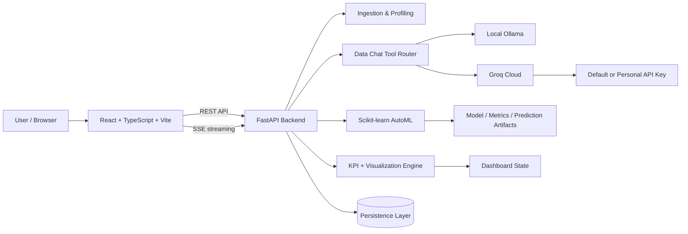

### Main technology stack

| Layer | Technologies |
|---|---|
| Frontend | React 18, TypeScript, Vite, Tailwind CSS, Recharts, Lucide |
| Backend | FastAPI, Python, Pandas, NumPy |
| Machine Learning | Scikit-learn, Joblib |
| AI / LLM | Ollama (`llama3.2:3b`) and optional configured cloud provider |
| Persistence | SQLAlchemy with local/database-backed application state |
| Testing | Pytest |
| Communication | REST APIs + Server-Sent Events (SSE) |

---

## 🧠 Technical Logic

### 1. Data ingestion and smart coercion

Real-world columns often contain values such as:

```text
"$1,250.50"
"85%"
"1,000"
```

These may be parsed as strings instead of numerical values. InsightIQ applies cleaning/coercion rules before analytics and ML so valid numerical strings can become numerical vectors.

**Pipeline idea:**

```text
Upload
  ↓
Format parser
  ↓
Schema inference
  ↓
Numeric/categorical/date coercion
  ↓
Missing/duplicate/constant checks
  ↓
Profiling + quality score
  ↓
Analytics / ML / Chat
```

### 2. Data-quality profiling

The profiling layer computes dataset-level and column-level diagnostics such as:

- row and column count
- missing-value ratios
- duplicate rows
- constant columns
- cardinality and uniqueness
- likely identifiers
- inferred semantic/data types

These diagnostics are reused by Analytics and Data Science instead of treating upload, BI, and ML as disconnected workflows.

### 3. KPI and DAX recommendation logic

Columns are classified into roles such as:

- `MEASURE`
- `DIMENSION`
- `IDENTIFIER`
- `COORDINATE`
- `FREE_TEXT`

From those roles, the system can recommend aggregations such as:

```DAX
Total Records = COUNTROWS('Dataset')
Total Property Loss = SUM('Dataset'[property_loss_usd])
Average Suspect Age = AVERAGE('Dataset'[suspect_age])
```

A recommendation is more useful when it considers both **data type** and **business meaning**. For example, an age column is usually better represented by average/median/distribution than by total age.

### 4. Chart recommendation logic

The visualization engine maps data relationships to chart families. Typical heuristics include:

- **datetime + numeric** → line chart
- **categorical + numeric** → bar chart
- **numeric + numeric** → scatter plot
- **single aggregate** → KPI card
- high-cardinality categories → restrict, rank, group, or avoid unreadable charts

### 5. AutoML target analysis

The target-analysis stage inspects target characteristics to determine the task:

```text
2 classes        → Binary Classification
3+ categories    → Multiclass Classification
Continuous value → Regression
```

Target recommendations should also consider:

- missingness
- cardinality
- class balance
- identifier-like behavior
- data leakage risk
- semantic suitability

### 6. Feature engineering and preprocessing

Before model fitting, features need model-safe preprocessing:

```text
Numerical
  ├─ missing-value handling
  └─ optional scaling depending on estimator

Categorical
  ├─ normalization
  ├─ missing category handling
  ├─ rare-category grouping
  └─ encoding

Identifiers / free text / leakage columns
  └─ excluded unless explicitly supported
```

High-cardinality columns should not be blindly one-hot encoded because they can dramatically increase dimensionality and overfit the training set.

### 7. Model recommendation and training

The documented model suite includes:

**Classification**
- Random Forest
- Decision Tree
- Logistic Regression

**Regression**
- Random Forest Regressor
- Decision Tree Regressor
- Ridge Regression
- Linear Regression

Model selection should be based on the detected task, feature types, row count, cardinality, interpretability needs, and training cost—not only on a static ranking.

### 8. Evaluation logic

Classification views can include:

- Accuracy
- Precision
- Recall
- F1-score
- ROC-AUC where valid
- confusion matrix
- baseline comparison
- feature importance

Regression views can include:

- MAE
- MSE
- RMSE
- R²

A model should not be described as "good" simply because it trained successfully. InsightIQ already surfaces warnings when performance is near a naive baseline; this is an important design behavior.

### 9. Prediction playground

The prediction UI sends one feature vector through the **same preprocessing path used during training** and then calls the fitted estimator. Keeping training and inference preprocessing identical is essential; ideally this is implemented with a Scikit-learn `Pipeline`/`ColumnTransformer`.

### 10. Data Chat tool-calling

Data Chat should not calculate dataset statistics by guessing from natural language. The intended logic is:

```text
User question
   ↓
LLM decides whether a tool is needed
   ↓
Backend validates tool arguments
   ↓
Pandas executes the calculation on the active dataset
   ↓
Structured tool result
   ↓
LLM explains the verified result
```

Documented tools include:

```text
get_dataset_summary()
calculate_statistic(column, stat_type)
aggregate_data(group_by, target_column, aggregation)
find_top_categories(column, n)
recommend_chart(x_axis, y_axis)
```

This separation makes the LLM an **orchestrator/explainer** while the backend remains the source of truth for numerical answers.

---

## 🔐 Local vs Cloud AI Access & Privacy

InsightIQ supports both **local** and **cloud** LLM execution, and the Settings page makes the active option visible to the user.

### Local Ollama mode

When Ollama is installed and the configured model is available, the application can use local inference for Data Chat and tool-calling. This is the preferred mode when the user wants LLM processing to stay on the local machine.

### Groq Cloud mode

Groq can be used when cloud inference is preferred or when Ollama is not available. InsightIQ can work with configured/default Groq access, and the user can also provide a **personal Groq API key** from Settings for independent access.

This personal-key option is especially useful when:

- shared/default API access reaches a provider usage limit
- the configured API access is unavailable
- the user wants to use his own account/quota
- the user wants to switch away from the local Ollama setup

### Provider fallback concept

```text
Local Ollama available?
├─ Yes → user can use local LLM
└─ No  → use Groq Cloud

Groq default access available?
├─ Yes → use configured/default access
└─ No  → user can enter personal Groq API key
```

The application should always make the active provider clear because local and cloud modes have different privacy properties.

Recommended security behavior:

- never commit API keys to GitHub
- avoid storing provider secrets in frontend source code
- mask saved keys in the UI
- send only the minimum dataset context needed by the cloud provider
- clearly distinguish **Local** and **Cloud** modes
- allow the user to revoke/replace a personal key

---

## 📁 Recommended Repository Structure

```text
InsightIQ/
├── backend/
│   ├── app/
│   │   ├── api/                 # FastAPI routers/endpoints
│   │   ├── core/                # configuration, security, storage
│   │   ├── services/            # ingestion, analytics, chat, ML logic
│   │   ├── models/              # DB / domain models
│   │   └── main.py
│   ├── tests/
│   ├── requirements.txt
│   └── .env.example
│
├── frontend/
│   ├── src/
│   │   ├── components/
│   │   ├── pages/
│   │   ├── features/
│   │   ├── services/            # API client
│   │   ├── store/
│   │   ├── types/
│   │   └── utils/
│   ├── package.json
│   └── .env.example
│
├── docs/
│   ├── screenshots/
│   ├── ARCHITECTURE.md
│   ├── API.md
│   ├── TECHNICAL_QA.md
│   └── MODELING_NOTES.md
│
├── .github/
│   └── workflows/
│       └── ci.yml
├── .gitignore
├── LICENSE
├── CONTRIBUTING.md
├── SECURITY.md
└── README.md
```

The exact folder names can differ; the important goal is to separate **routing/UI**, **business logic**, **data/ML services**, **persistence**, and **tests**.

---

## 🚀 Local Setup

### Prerequisites

- Node.js 18+
- Python 3.10+
- npm
- Ollama for local LLM mode

### 1. Clone the repository

```bash
git clone https://github.com/nankarkalpesh/InsightIQ.git
cd InsightIQ
```

### 2. Start Ollama

```bash
ollama pull llama3.2:3b
ollama serve
```

### 3. Start the backend

```bash
cd backend
python -m venv venv
```

**Windows**

```bash
.\venv\Scripts\activate
```

**macOS / Linux**

```bash
source venv/bin/activate
```

Install and run:

```bash
pip install -r requirements.txt
```

### 4. Start the frontend

Open a second terminal:

```bash
cd frontend
npm install
npm run dev
```


---

## 🧪 Testing

The project documentation records a backend suite of **106 Pytest tests**.

Run the current suite yourself:

```bash
cd backend
pytest tests/ -v
```

Before publishing a permanent "106/106 passing" badge, make CI run these tests on every push so the claim always matches the current commit.

Recommended CI checks:

```text
Backend
- install dependencies
- pytest
- Ruff/Flake8
- mypy/pyright where practical

Frontend
- npm ci
- ESLint
- TypeScript type-check
- npm build
- component/unit tests
```

---

## 🧩 Important Engineering Problems Solved

### Messy numeric values

**Problem:** currency and percentage strings may be loaded as object/string columns.

**Approach:** normalize formatted values and coerce them before analytics/ML.

### Hallucinated statistics in AI chat

**Problem:** an LLM can invent numerical answers.

**Approach:** route quantitative questions through deterministic backend tools and let the LLM explain returned values.

### Categorical spelling and prefix variants

**Problem:** categories can differ by case, typo, whitespace, or abbreviation.

**Approach:** fuzzy/canonical normalization with ambiguity detection rather than blindly merging every near-match.

### Persistent dataset activity

**Problem:** uploaded files and workflow state can disappear after a restart/session change.

**Approach:** persist dataset metadata/files and saved activity instead of depending only on temporary browser/server memory.

### High-cardinality ML features

**Problem:** a categorical column with thousands of unique values can make training noisy, expensive, and prone to overfitting.

**Approach:** detect high cardinality, warn the user, group rare categories or exclude the feature, and compare against a naive baseline.

---

## ❓ Technical Viva / Interview Questions

### Why FastAPI?

FastAPI fits a data/ML backend because it provides typed request validation, async API support, automatic OpenAPI/Swagger docs, and clean integration with the Python data-science ecosystem.

### Why React + TypeScript?

React supports a component-driven analytics UI, while TypeScript helps keep dataset schemas, API responses, chart configurations, and model-result objects predictable.

### Why use backend tools in Data Chat?

Dataset answers must be derived from actual data. Tool calls let Pandas compute verified values while the LLM focuses on intent understanding and explanation.

### How do you prevent target leakage?

Exclude columns that directly reveal the target, post-outcome fields, identifiers, or features unavailable at real prediction time. Leakage checks should happen before train/test splitting.

### Why compare against a baseline?

A model can have non-zero accuracy but still be useless. For classification, majority-class or stratified baselines show whether the model actually learned useful predictive signal.

### Why can Accuracy be misleading?

With class imbalance, a model can predict the majority class and obtain high accuracy while failing minority classes. Precision, recall, F1, per-class metrics, and confusion matrices provide better context.

### Why use a train/test split?

The model must be evaluated on data it did not train on. Otherwise the reported performance measures memorization rather than generalization.

### How should preprocessing be handled?

Fit preprocessing only on training data, then apply the fitted transformations to validation/test and prediction inputs. A `Pipeline` and `ColumnTransformer` reduce leakage and training/inference mismatch.

### Random Forest vs Logistic Regression?

Random Forest captures non-linear interactions and usually needs less scaling. Logistic Regression is faster, more interpretable, and works well when relationships are approximately linear after encoding.

### What is feature importance?

It estimates how strongly features influence a fitted model, but it is not proof of causality. Impurity-based tree importance can also be biased toward high-cardinality features.

### Why is high cardinality a problem?

One-hot encoding can create thousands of columns, while direct categorical grouping may overfit rare values. The system should identify such features before training.

### Why use SSE for chat?

Server-Sent Events are a simple one-way streaming mechanism that lets the backend progressively send generated text/tool events to the browser over a normal HTTP connection.

### Why local Ollama?

It enables local inference, lower dependence on external APIs, and stronger privacy for sensitive data—subject to the actual application configuration.

### What changes when using a cloud LLM?

The application must clearly define what data/context is sent to the provider, secure API keys, avoid transmitting full datasets unnecessarily, and update the privacy statement accordingly.

### How do you persist a trained model?

Serialize the complete preprocessing + estimator pipeline with Joblib, and store the feature schema/model metadata needed to validate future prediction inputs.

### What is the most important limitation of this AutoML system?

Automated model fitting cannot replace domain understanding. Bad targets, leakage, biased features, invalid values, or insufficient signal will still produce weak or misleading models.

---

## ⚠️ Current Limitations

- Tabular-data focus; no unstructured document/image analytics pipeline.
- Model recommendations are heuristic and should not be treated as guaranteed best models.
- High-cardinality and noisy categorical columns can reduce predictive performance.
- Dataset-specific domain validation is still required.
- Local LLM quality depends on available machine resources and the chosen model.
- Cloud-provider mode has different privacy properties from local Ollama mode.
- A frontend deployment alone does not make local backend/Ollama functionality publicly available.

---

## 🔧 Recommended Improvements

The current project already covers the complete analytics-to-ML workflow. The following improvements would make InsightIQ stronger technically and more production-ready:

- **Improve semantic column detection** so unique datetime fields are not accidentally classified as identifiers.
- **Improve KPI semantics** so columns such as age prioritize average, median, distribution, or range rather than meaningless totals.
- **Add domain validation and outlier detection** for impossible values such as negative ages or unrealistic numeric ranges.
- **Strengthen high-cardinality handling** before model training to avoid noisy categorical features and very large encoded feature spaces.
- **Add target-leakage detection** for IDs, post-outcome fields, direct target proxies, and unavailable-at-inference features.
- **Add sensitive-feature warnings** when demographic attributes such as gender or race are selected for modeling.
- **Use reproducible Scikit-learn pipelines** with `Pipeline` and `ColumnTransformer` so training and prediction preprocessing remain identical.
- **Add cross-validation and per-class evaluation** instead of relying only on one train/test split and weighted metrics.
- **Add frontend tests and end-to-end tests** in addition to the backend Pytest suite.
- **Add GitHub Actions CI** to verify backend tests, frontend build, linting, and type checking on every push.
- **Add Docker / Docker Compose** for reproducible setup.
- **Add `LICENSE`, `SECURITY.md`, `CONTRIBUTING.md`, and `.env.example`** files at the repository root.
- **Add clear local-vs-cloud AI privacy indicators** so users always know whether Ollama or Groq is active.
- **Store LLM credentials securely** and never expose personal API keys in source code or committed files.
- **Add downloadable analytics reports** and model experiment history as future product features.

---

## 🗺️ Roadmap

- [ ] Add automated data-validity rules and configurable column constraints
- [ ] Improve identifier/date/measure semantic detection
- [ ] Add outlier and impossible-value detection before charting/modeling
- [ ] Add leakage detection and sensitive-feature warnings
- [ ] Add cross-validation and hyperparameter tuning
- [ ] Add calibration / per-class metrics for multiclass models
- [ ] Add model experiment history and reproducibility metadata
- [ ] Add SQL/PostgreSQL data connectors
- [ ] Add downloadable analytics report (PDF/HTML)
- [ ] Add Docker + Docker Compose
- [ ] Add GitHub Actions CI
- [ ] Add frontend tests and API contract tests
- [ ] Add observability/logging and request IDs
- [ ] Add production deployment documentation

---

## 🤝 Contributing

Contributions, bug reports, and improvement ideas are welcome.

Recommended contribution flow:

```bash
git checkout -b feature/your-feature
# make changes
pytest
npm run build
git commit -m "feat: describe your change"
git push origin feature/your-feature
```

Then open a pull request with:

- problem being solved
- screenshots for UI changes
- test evidence
- breaking changes, if any

---

## 🔒 Security & Data Responsibility

Do not commit:

- API keys
- JWT secrets
- database passwords
- uploaded private datasets
- exported user models containing sensitive training information

Keep secrets in environment variables and provide safe placeholders in `.env.example`.

When datasets contain sensitive attributes (for example gender, race, health, finance, or other protected information), model results should be treated carefully. Predictive performance does not establish fairness, causality, or suitability for high-stakes decisions.

---

## 📄 License

The README previously states **MIT License**, but the repository should also contain an actual `LICENSE` file at the repository root. Add the MIT license file if MIT is the intended license.

---

## 🌐 Live Project

[InsightIQ | AI-Powered Data Analytics & Data Science Workspace](https://insightiq-analytics.vercel.app/)

---

## 👨‍💻 Author

**Kalpesh Nankar**

InsightIQ was developed as a full-stack AI/data analytics project demonstrating practical work across:

**frontend engineering · backend APIs · data processing · visualization · machine learning · LLM tool-calling · persistence · testing**

---

## ⭐ If this project helps you

Give the repository a star and feel free to open an issue with feedback, bugs, or feature ideas.
